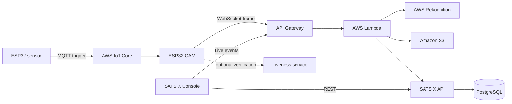

<div align="center">
  

  # SATS X

  **Intelligent attendance infrastructure for connected learning environments.**

  Edge capture, verified biometric identity, real-time operations, and clear attendance records in one system.
</div>

## Repository structure

```text
sats-x/
├── frontend/        React and Vite operations console
├── backend/         Express, Prisma, and PostgreSQL API
├── infrastructure/  Terraform and AWS Lambda resources
├── iot/             ESP32 and ESP32-CAM firmware
└── liveness/        FastAPI and TensorFlow anti-spoofing service
```

| Component | Stack | Responsibility |
| --- | --- | --- |
| [`frontend`](frontend) | React 18, Vite, Tailwind CSS | Instructor workspace, live attendance, schedules, identity enrollment |
| [`backend`](backend) | Node.js, Express, Prisma, PostgreSQL | Authentication, academic data, attendance persistence, device API |
| [`infrastructure`](infrastructure) | Terraform, AWS Lambda, API Gateway, S3, Rekognition, IoT Core | Cloud infrastructure and event processing |
| [`iot`](iot) | C++, PlatformIO, ESP32, ESP32-CAM | Proximity sensing, image capture, device feedback, MQTT/WebSocket transport |
| [`liveness`](liveness) | Python, FastAPI, TensorFlow, OpenCV | Real-time liveness classification and evaluation |

## System flow



## Core capabilities

- Touchless attendance through connected edge cameras.
- Class-scoped biometric identity collections with confidence-aware matching.
- Live WebSocket events, remote capture controls, and connection diagnostics.
- Student, class, subject, schedule, and attendance administration.
- Direct presigned S3 uploads for face registration without WebSocket frame overflow.
- Optional anti-spoofing inference for presentation-attack detection.
- Reproducible AWS infrastructure with Terraform.

## Quick start

### Frontend

```bash
cp frontend/.env.example frontend/.env
npm --prefix frontend install
npm run dev:web
```

### Backend

```bash
cp backend/.env.example backend/.env
npm --prefix backend install
npm run dev:api
```

### Infrastructure

```bash
cd infrastructure
cp terraform.tfvars.example terraform.tfvars
terraform init
terraform plan
```

### IoT firmware

```bash
cd iot
pio run
```

### Liveness service

```bash
cd liveness
python3 -m venv .venv
source .venv/bin/activate
pip install -r requirements.txt
uvicorn app.main:app --reload
```

## Configuration and security

Copy the example environment files within each component and provide local values. Never commit credentials, Terraform state, private keys, database passwords, JWT secrets, service tokens, or device certificates.

All browser-exposed `VITE_*` variables are public at build time. Privileged S3 and Rekognition operations must remain behind Lambda IAM roles or authenticated backend endpoints.

## Documentation

Each component contains focused setup and operational documentation:

- [Frontend documentation](frontend/README.md)
- [Backend documentation](backend/README.md)
- [Infrastructure documentation](infrastructure/README.md)
- [IoT firmware documentation](iot/README.md)
- [Liveness service documentation](liveness/README.md)

## License

SATS X is released under the [MIT License](LICENSE).
