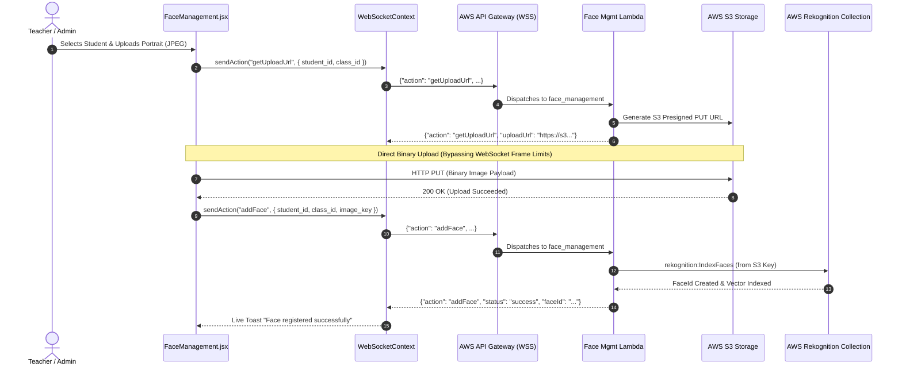

# SATS X — Intelligent Attendance Console

[](https://react.dev/)
[](https://vitejs.dev/)
[](https://tailwindcss.com/)
[](https://reactrouter.com/)
[](https://aws.amazon.com/api-gateway/)
[](https://axios-http.com/)

> **Real-Time Faculty Web Dashboard** for Academic Administration, Biometric Face Enrollment, and Live Facial Attendance Monitoring.

**SATS X** is a modern Single Page Application for educators and administrators. It provides fast management of subjects, classes, student registries, and timetables, paired with a resilient WebSocket connection to AWS API Gateway for live attendance events and remote IoT camera triggers.

---

## Table of Contents

- [Application Architecture](#application-architecture)
- [Real-Time WebSocket & S3 Upload Workflow](#real-time-websocket--s3-upload-workflow)
  - [Presigned S3 Direct Enrollment Flow](#presigned-s3-direct-enrollment-flow)
  - [Resilient Single-Socket Management](#resilient-single-socket-management)
- [Key Modules & User Interfaces](#key-modules--user-interfaces)
- [SATS X Design System](#sats-x-design-system)
- [Local Development & Quickstart](#local-development--quickstart)
- [Production Deployment (EC2 & Nginx Reverse Proxy)](#production-deployment-ec2--nginx-reverse-proxy)
- [Environment Configuration Reference](#environment-configuration-reference)
- [Part of the Ecosystem](#part-of-the-ecosystem)

---

## Application Architecture

The frontend application follows a clean modular hierarchy separating UI components, state management contexts, domain API services, and WebSocket listeners:

```mermaid
flowchart TD
    subgraph UI["Presentation Layer (React 18 + Tailwind)"]
        ROUTER["React Router v6 (/dashboard, /attendance, /faces, ...)"]
        PAGES["Domain Pages (Dashboard, Attendance, FaceMgmt, etc.)"]
        COMPONENTS["Reusable Design System Tokens & Components"]
    end

    subgraph State["Global State Layer (React Contexts)"]
        AUTH_CTX["AuthContext (In-Memory AccessToken & User Profile)"]
        WS_CTX["WebSocketContext (Single Persistent WSS Connection)"]
        TOAST_CTX["ToastContext (Live System Notifications)"]
        THEME_CTX["ThemeContext (Dark / Light Mode)"]
        LANG_CTX["LanguageContext (English product copy)"]
    end

    subgraph Transport["Network & Transport Layer"]
        AXIOS["Axios Instance (Auto 401 Interceptor & Refresh Queue)"]
        WS_MGR["WebSocket Manager (25s Heartbeat Ping, Exponential Backoff)"]
    end

    subgraph BackendServices["Cloud & Backend Infrastructure"]
        BE_API["Express Backend API (:4000)"]
        APIGW["AWS API Gateway WebSocket (wss://...)"]
        S3["AWS S3 Bucket (Presigned Direct Uploads)"]
    end

    ROUTER --> PAGES
    PAGES --> COMPONENTS
    PAGES --> AUTH_CTX
    PAGES --> WS_CTX
    PAGES --> TOAST_CTX

    AUTH_CTX --> AXIOS
    WS_CTX --> WS_MGR

    AXIOS -->|REST over HTTPS (JWT Bearer)| BE_API
    WS_MGR -->|WSS Protocol (Action Payloads)| APIGW
    PAGES -.->|Direct Binary PUT (Presigned URL)| S3
```

---

## Real-Time WebSocket & S3 Upload Workflow

### Presigned S3 Direct Enrollment Flow

To overcome the **32 KB WebSocket frame limit** enforced by AWS API Gateway (which disconnects with code `1009` when clients attempt to transmit high-resolution camera images directly over sockets), the dashboard implements a presigned direct S3 upload architecture:



### Resilient Single-Socket Management
- **Single Connection Instance**: A unified WebSocket connection (`WebSocketContext.jsx`) is initialized at the root of `App.jsx`, shared seamlessly across all views (Live Attendance, Face Management, Device Shutter Triggers).
- **NAT / Firewall Keep-Alive Heartbeat**: Sends a periodic `{"action": "ping"}` frame every **25 seconds** to prevent aggressive client NAT routers or mobile firewalls from silently dropping idle sockets before the AWS 10-minute timeout.
- **Auto-Reconnection**: Reconnects automatically with exponential backoff and jitter upon network interruptions.

---

## Key Modules & User Interfaces

| Page / Route | Core Capabilities |
|:---|:---|
| [`Dashboard.jsx`](src/pages/Dashboard.jsx) | Real-time overview metrics, live recognition events, and operational shortcuts. |
| [`Attendance.jsx`](src/pages/Attendance.jsx) | Attendance records, class and status filters, remote capture, and CSV export. |
| [`FaceManagement.jsx`](src/pages/FaceManagement.jsx) | Biometric enrollment, Rekognition collection browsing, and face deletion. |
| [`Classes.jsx`](src/pages/Classes.jsx) | Class CRUD, roster counts, and face-collection access. |
| [`Students.jsx`](src/pages/Students.jsx) | Student registry, search, filters, details, and identity management. |
| [`Subject.jsx`](src/pages/Subject.jsx) | Subject overview, class counts, enrollment, and teaching links. |
| [`Schedule.jsx`](src/pages/Schedule.jsx) | Weekly sessions, room assignments, and attendance entry points. |
| [`Profile.jsx`](src/pages/Profile.jsx) | Instructor profile, department details, and account security. |
| [`Settings.jsx`](src/pages/Settings.jsx) | WebSocket diagnostics, AWS infrastructure details, and appearance settings. |

---

## SATS X Design System

- **Aurora-teal signature**: A focused emerald-to-cyan gradient identifies primary actions and brand-bearing surfaces.
- **Operational neutrals**: Cool, low-chroma surfaces keep dense attendance data readable in light and dark themes.
- **Typography**: Outfit carries product hierarchy while IBM Plex Mono aligns identifiers, time values, and metrics.
- **Dark & Light Mode**: Persistent theme switching managed via `ThemeContext` and Tailwind `dark:` variants.
- **English-only interface**: Product copy and operational messages use one consistent language throughout the application.

---

## Local Development & Quickstart

### Prerequisites
- **Node.js**: v18.0.0 or later
- Running Backend API (`backend`) on port `4000`

### Step-by-Step Setup

1. **Install Dependencies**:
   ```bash
   cd frontend
   npm install
   ```

2. **Configure Environment Variables**:
   ```bash
   cp .env.example .env
   ```
   Configure `.env` values:
   ```ini
   VITE_API_BASE_URL=http://localhost:4000
   VITE_WS_URL=wss://<YOUR_API_ID>.execute-api.ap-southeast-1.amazonaws.com/production
   VITE_AWS_REGION=ap-southeast-1
   VITE_AWS_S3_BUCKET=attendance-system-faces-xxxx
   ```

3. **Start Local Development Server**:
   ```bash
   npm run dev
   ```
   Access the dashboard at `http://localhost:3000`.

### Authentication

Use an instructor account provisioned by the SATS X backend. Activate invited accounts from the sign-in screen before the first login.

---

## Production Deployment (EC2 & Nginx Reverse Proxy)

In production, the frontend is compiled into optimized static assets and served via an **Nginx Reverse Proxy** co-located on the same EC2 instance as the backend.

### Benefits of the Nginx Reverse Proxy Architecture:
1. **Zero CORS Issues**: The browser interacts exclusively with a single origin (e.g., `http://<EC2_IP>`).
2. **Secure Cookie Handling**: The `httpOnly` refresh token cookie functions reliably without third-party cookie blocking.
3. **Low Memory Footprint**: Build occurs on developer machines or CI pipelines, avoiding OOM spikes on the `t3.micro` instance.

```mermaid
flowchart LR
    BROWSER((Client Browser)) -->|HTTP Requests| NGINX["Nginx Server (:80 / :443)"]

    subgraph EC2["AWS EC2 Host"]
        NGINX -->|/* (Static Assets)| DIST["/frontend/dist (React SPA)"]
        NGINX -->|/api/* (Reverse Proxy)| BE_DOCKER["backend Container (:4000)"]
    end
```

### Build & Deploy Procedure

1. **Build Static Bundle Locally**:
   ```bash
   # Set VITE_API_BASE_URL="" in .env.production for relative path proxying
   npm run build
   ```

2. **Copy Artifacts to EC2**:
   ```bash
   scp -i backend-key.pem -r dist deploy ubuntu@<BACKEND_PUBLIC_IP>:~/frontend/
   ```

3. **Reload Production Nginx Web Container**:
   ```bash
   ssh -i backend-key.pem ubuntu@<BACKEND_PUBLIC_IP> \
     "cd ~/backend && docker compose -f docker-compose.prod.yml up -d --build web"
   ```

---

## Environment Configuration Reference

| Variable | Type | Default / Example | Purpose |
|:---|:---|:---|:---|
| `VITE_API_BASE_URL` | `string` | `http://localhost:4000` *(dev)* / `""` *(prod)* | REST API backend endpoint |
| `VITE_WS_URL` | `string` | `wss://xxxx.execute-api.ap-southeast-1.amazonaws.com/prod` | AWS API Gateway WebSocket URL |
| `VITE_AWS_REGION` | `string` | `ap-southeast-1` | AWS deployment region (public S3 path resolution) |
| `VITE_AWS_S3_BUCKET` | `string` | `attendance-system-dev-faces` | S3 bucket identifier for face audit assets |

> [!WARNING]
> All `VITE_*` variables are embedded directly into client JavaScript bundles. **Never inject AWS Access Keys, Secret Keys, or Service Tokens into this file.**

---

## Part of the Ecosystem

| Repository | Primary Technology | Responsibility |
|:---|:---|:---|
| **`sats-x`** *(This repo)* | React 18, Vite, Tailwind CSS | Instructor console and live attendance monitor |
| [**`backend`**](../backend) | Express, PostgreSQL, Prisma | Core REST API, Auth, Database ORM, IoT Webhooks |
| [**`infrastructure`**](../infrastructure) | Terraform, AWS Lambda, S3, IoT Core | Serverless AWS Cloud Infrastructure & Pipelines |
| [**`iot`**](../iot) | PlatformIO, ESP32, ESP32-CAM | Edge Hardware: Face Capture, LCD UI, Distance Trigger |
| [**`liveness`**](../liveness) | FastAPI, TensorFlow, WebSockets | Real-time Deep Learning Anti-Spoofing Microservice |
