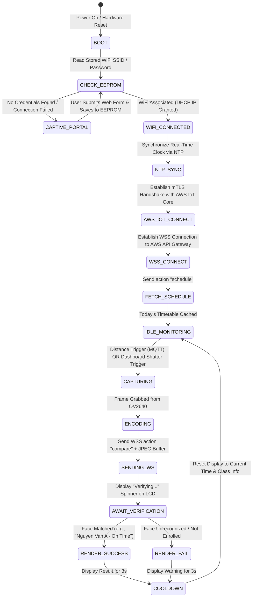
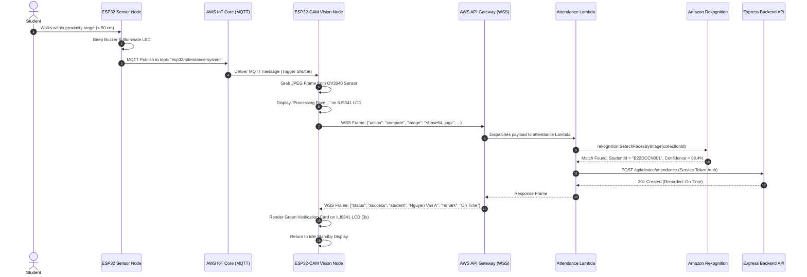

# 🤖 Attendance System — Edge IoT Firmware

[](https://platformio.org/)
[](https://www.espressif.com/)
[](https://isocpp.org/)
[](https://www.arduino.cc/)
[](https://aws.amazon.com/iot-core/)
[](https://github.com/Bodmer/TFT_eSPI)

> **Dual-Node Edge IoT Firmware** orchestrating ultrasonic distance detection, high-resolution portrait capture, mTLS AWS IoT Core messaging, bidirectional WebSocket streaming, and live TFT LCD feedback rendering.

The **Attendance System IoT** repository contains the production firmware powering the physical attendance kiosks. The edge architecture employs a **cooperative dual-node microcontroller design**: an ESP32 sensor node continuously monitors physical proximity, and an ESP32-CAM node executes precision camera shutter triggers, communicates with AWS cloud services, and renders live verification outcomes on a color TFT LCD display.

---

## 📑 Table of Contents

- [Edge System Architecture](#-edge-system-architecture)
- [Hardware Specifications & Pinout Mapping](#-hardware-specifications--pinout-mapping)
- [Firmware State Machine & Logic Flow](#-firmware-state-machine--logic-flow)
- [Dual-Node Communication Sequence](#-dual-node-communication-sequence)
- [WiFi Auto-Provisioning (Captive Portal)](#-wifi-auto-provisioning-captive-portal)
- [Cryptographic Secrets Configuration](#-cryptographic-secrets-configuration)
- [Build, Flashing & Monitoring with PlatformIO](#-build-flashing--monitoring-with-platformio)
- [Hardware Diagnostics & Troubleshooting](#-hardware-diagnostics--troubleshooting)
- [Part of the Ecosystem](#-part-of-the-ecosystem)

---

## 🏛 Edge System Architecture

The hardware deployment splits real-time sensor polling from memory-intensive camera and display processing:

```mermaid
flowchart TB
    subgraph Node1["Node 1: Distance Sensing Station (ESP32 DevKit V1)"]
        SENSOR["Ultrasonic / Distance Sensor"]
        BUZZER["Auditory Buzzer"]
        LED["Visual LED Indicator"]
        FW1["Sensor Firmware (src/esp32/main.cpp)"]
    end

    subgraph Node2["Node 2: Vision & Kiosk Display (ESP32-CAM AI-Thinker)"]
        CAM["OV2640 Camera Sensor (JPEG Capture)"]
        LCD["2.8\" ILI9341 SPI TFT LCD (320x240)"]
        WIFI_PORTAL["Captive Portal Web Server (EEPROM Config)"]
        FW2["Vision Firmware (src/esp32cam/main.cpp)"]
    end

    subgraph CloudBridge["AWS Cloud Services"]
        IOT["AWS IoT Core (MQTT Broker over mTLS)"]
        APIGW["AWS API Gateway WebSocket (wss://...)"]
    end

    SENSOR -->|Distance < Threshold| FW1
    FW1 --> BUZZER
    FW1 --> LED
    FW1 -->|mTLS MQTT Publish\nTopic: esp32-cam/attendance-system| IOT

    IOT -->|mTLS MQTT Deliver\nTopic: esp32/attendance-system| FW2
    FW2 --> CAM
    CAM -->|JPEG Buffer| FW2
    FW2 -->|WSS Binary Frame: compare| APIGW
    APIGW -->>|WSS Result Frame: {name, status, time}| FW2
    FW2 -->|Render Verification Card| LCD
```

---

## 🔌 Hardware Specifications & Pinout Mapping

### Dual-Node Hardware Allocation

| Node | Microcontroller Board | Core Peripherals | Primary Responsibilities | PlatformIO Env |
|:---|:---|:---|:---|:---|
| **Vision & UI Node** | **ESP32-CAM (AI-Thinker)** | OV2640 2MP Camera, 2.8" ILI9341 SPI TFT LCD, PSRAM | Captures portraits, streams over WebSocket, renders UI cards, subscribes to MQTT commands | `[env:esp32cam]` |
| **Proximity Node** | **ESP32 DoIT DevKit V1** | HC-SR04 / Ultrasonic Sensor, Active Buzzer, Status LED | Continuously scans for approaching students, beeps, and triggers vision node via MQTT | `[env:esp32doit-devkit-v1]` |

### ILI9341 TFT SPI Display Pinout on ESP32-CAM

Because the ESP32-CAM uses many GPIOs for its 8-bit parallel camera interface and flash LED, the SPI display lines are mapped specifically via `build_flags` in `platformio.ini`:

| TFT LCD Pin | ESP32-CAM GPIO | Description | Configuration Flag in `platformio.ini` |
|:---|:---|:---|:---|
| **MOSI / SDI** | `GPIO 13` | SPI Data Master-Out-Slave-In | `-D TFT_MOSI=13` |
| **SCLK / SCK** | `GPIO 14` | SPI Clock Signal (40 MHz) | `-D TFT_SCLK=14` |
| **CS** | `GPIO 15` | Chip Select Active Low | `-D TFT_CS=15` |
| **DC / RS** | `GPIO 2` | Data / Command Selection | `-D TFT_DC=2` |
| **RST / RESET** | `GPIO 12` | Hardware Reset | `-D TFT_RST=12` |
| **VCC / GND** | `5V / GND` | Power Supply Rails | Shared regulated power rail |

---

## 🔄 Firmware State Machine & Logic Flow



---

## 📡 Dual-Node Communication Sequence



---

## 📶 WiFi Auto-Provisioning (Captive Portal)

To avoid hardcoding WiFi credentials into firmware builds:
1. On boot, if no valid network configuration is found in non-volatile EEPROM storage, the device spins up an **Access Point** named `ESP32-Attendance-Config`.
2. Connecting to this AP automatically redirects the user's mobile or PC browser via a DNS Captive Portal to a configuration page (`lib/wifi_connect/wifi_config_page.h`).
3. The user selects their local 2.4 GHz WiFi network, enters the password, and clicks **Save & Connect**.
4. The credentials are encrypted and stored in EEPROM, and the microcontroller automatically restarts and joins the network.

---

## 🔒 Cryptographic Secrets Configuration

All AWS IoT client certificates and private keys reside in `lib/secrets/` (excluded from version control). Retrieve them directly from Terraform outputs in `infrastructure`:

```bash
# 1. Fetch AWS IoT device credentials from Terraform
cd ../infrastructure
terraform output -json iot_certificate_pems > certs.json
terraform output -json iot_private_keys > keys.json
```

### 1. `lib/secrets/aws_root_ca.h`
Standard Amazon Root CA 1 certificate:
```cpp
static const char AWS_CERT_CA[] PROGMEM = R"EOF(
-----BEGIN CERTIFICATE-----
MIIEkjCCA3qgAwIBAgITBn+TuWrDateTime...
-----END CERTIFICATE-----
)EOF";
```

### 2. `lib/secrets/secrets_esp32.h` (Sensor Node)
```cpp
#define THINGNAME_ESP32        "attendance-system-dev-esp32-sensor"
#define AWS_IOT_ENDPOINT_ESP32  "xxxx-ats.iot.ap-southeast-1.amazonaws.com"
static const char AWS_CERT_CRT_ESP32[]     PROGMEM = R"EOF(...)EOF";
static const char AWS_CERT_PRIVATE_ESP32[] PROGMEM = R"EOF(...)EOF";
```

### 3. `lib/secrets/secrets_esp32-cam.h` (Vision Node)
```cpp
#define THINGNAME_ESP32_CAM        "attendance-system-dev-esp32-cam"
#define AWS_IOT_ENDPOINT_ESP32_CAM  "xxxx-ats.iot.ap-southeast-1.amazonaws.com"
static const char AWS_CERT_CRT_ESP32_CAM[]     PROGMEM = R"EOF(...)EOF";
static const char AWS_CERT_PRIVATE_ESP32_CAM[] PROGMEM = R"EOF(...)EOF";
```

### Synchronize Headers for IntelliSense
```bash
cp lib/secrets/aws_root_ca.h lib/secrets/secrets_esp32.h lib/secrets/secrets_esp32-cam.h include/
```

---

## 💻 Build, Flashing & Monitoring with PlatformIO

### Prerequisites
- [VS Code](https://code.visualstudio.com/) with the [PlatformIO IDE Extension](https://platformio.org/install/ide?install=vscode) or [PlatformIO Core CLI](https://docs.platformio.org/en/latest/core/index.html)

### Compiling & Flashing Vision Node (ESP32-CAM)
```bash
# Build firmware binary
pio run -e esp32cam

# Upload via FTDI Programmer / USB Serial (adjust upload_port in platformio.ini)
pio run -e esp32cam -t upload

# Open Serial Console (115200 baud)
pio device monitor -e esp32cam
```

### Compiling & Flashing Proximity Node (ESP32 DevKit)
```bash
# Build sensor firmware
pio run -e esp32doit-devkit-v1

# Upload to DevKit board
pio run -e esp32doit-devkit-v1 -t upload

# Open Serial Monitor
pio device monitor -e esp32doit-devkit-v1
```

---

## 🔍 Hardware Diagnostics & Troubleshooting

| Issue / Symptom | Root Cause | Resolution |
|:---|:---|:---|
| **LCD remains blank white upon boot** | Missing TFT SPI pin definitions or clock rate incompatibility in `platformio.ini`. | Ensure `build_flags` in `platformio.ini` specify `-D TFT_MOSI=13 -D TFT_SCLK=14 -D TFT_CS=15 -D TFT_DC=2 -D TFT_RST=12`. |
| **TLS Handshake / X.509 Certificate Error** | Certificate corrupted during copy-paste or endpoint mismatch. | Verify that `aws_root_ca.h` matches Amazon Root CA 1 SHA-256 fingerprint (`8E:CD:E6:88...`). Confirm the AWS IoT Endpoint matches your AWS account prefix. |
| **Camera fails to initialize (`0x20003`)** | Insufficient power rail current during OV2640 sensor startup or loose ribbon cable. | Power the ESP32-CAM from an external 5V / 2A dedicated supply rather than USB UART dongle 3.3V pins. Reseat the 24-pin FPC ribbon cable. |
| **`BACKEND_API_URL not configured` error in serial** | The attendance Lambda did not receive the backend URL environment variable. | Run `terraform apply` in `infrastructure` to ensure the EC2 backend URL is dynamically injected into the Lambda runtime configuration. |

---

## 🧩 Part of the Ecosystem

| Repository | Primary Technology | Responsibility |
|:---|:---|:---|
| **`iot`** *(This repo)* | PlatformIO, ESP32, ESP32-CAM | Edge Hardware: Face Capture, LCD UI, Distance Trigger |
| [**`backend`**](../backend) | Express, PostgreSQL, Prisma | Core REST API, Auth, Database ORM, IoT Webhooks |
| [**`frontend`**](../frontend) | React 18, Vite, Tailwind CSS | Teacher Web Dashboard, Live Attendance Monitor |
| [**`infrastructure`**](../infrastructure) | Terraform, AWS Lambda, S3, IoT Core | Serverless AWS Cloud Infrastructure & Pipelines |
| [**`liveness`**](../liveness) | FastAPI, TensorFlow, WebSockets | Real-time Deep Learning Anti-Spoofing Microservice |
