# 🎭 Attendance System — Face Anti-Spoofing & Liveness Detection Microservice

[](https://www.python.org/)
[](https://fastapi.tiangolo.com/)
[](https://www.tensorflow.org/)
[](https://opencv.org/)
[](https://www.uvicorn.org/)
[](https://developer.mozilla.org/en-US/docs/Web/API/WebSockets_API)

> **High-Throughput, Deep Learning Face Anti-Spoofing and Liveness Verification Service** featuring asynchronous bidirectional WebSocket streaming, automatic tensor shape detection, and custom convolutional neural network inference.

The **Liveness Detection Microservice** provides anti-spoofing protection for the Facial Attendance System, safeguarding against fraudulent check-in attempts using printed photographs, 2D digital screen replays, or static cutouts. Built with **FastAPI** and **TensorFlow**, it delivers ultra-low-latency classification (`<100ms`) with an accuracy of **86.0%** across rigorous benchmark datasets.

---

## 📑 Table of Contents

- [Deep Learning Pipeline Architecture](#-deep-learning-pipeline-architecture)
- [WebSocket & REST API Specifications](#-websocket--rest-api-specifications)
  - [Real-Time WebSocket Protocol (`/ws/liveness`)](#1-real-time-websocket-protocol-wsliveness)
  - [REST Health & Metadata Endpoints](#2-rest-health--metadata-endpoints)
- [Model Evaluation & Benchmark Report](#-model-evaluation--benchmark-report)
- [Local Installation & Quickstart](#-local-installation--quickstart)
- [Validation & Testing Toolkit](#-validation--testing-toolkit)
- [Production Deployment (Systemd & Uvicorn)](#-production-deployment-systemd--uvicorn)
- [Part of the Ecosystem](#-part-of-the-ecosystem)

---

## 🧠 Deep Learning Pipeline Architecture

The inference pipeline decodes incoming base64 image frames, performs adaptive geometric pre-processing, normalizes pixel tensors, and runs forward inference through a custom Convolutional Neural Network (`.h5` model) without external bulky framework dependencies:

```mermaid
flowchart LR
    subgraph Ingestion["1. Frame Ingestion"]
        WS_CLIENT["Client Stream / Camera Feed"] -->|Base64 JPEG / PNG Frame| WS_ENDPOINT["FastAPI WebSocket /ws/liveness"]
    end

    subgraph Preprocessing["2. Adaptive Image Preprocessing"]
        WS_ENDPOINT --> B64_DEC["Base64 Decode & Buffer Read"]
        B64_DEC --> CV_MAT["OpenCV Mat (RGB Color Space)"]
        CV_MAT --> AUTO_DETECT["Auto-Detect Model Input Shape\n(e.g., 96x96x3 or 224x224x3)"]
        AUTO_DETECT --> RESIZE["Bilinear Resizing & Tensor Reshape"]
        RESIZE --> NORM["Min-Max Float32 Normalization [0.0, 1.0]"]
    end

    subgraph Inference["3. Neural Network Inference"]
        NORM --> CNN["Custom TensorFlow CNN (.h5 Model)\nDirect tf.keras Inference Engine"]
        CNN --> SOFTMAX["Softmax Classification Layer"]
    end

    subgraph Classification["4. Evaluation & Response"]
        SOFTMAX --> DECISION{"P(Real) >= Threshold"}
        DECISION -->|Yes| REAL["Classification: REAL\nConfidence: 85% - 99%"]
        DECISION -->|No| FAKE["Classification: FAKE (Spoof Attempt)\nConfidence: 80% - 99%"]
        REAL --> JSON_OUT["JSON Payload + Processing Latency (ms)"]
        FAKE --> JSON_OUT
        JSON_OUT -->|WSS Response Frame| WS_CLIENT
    end
```



---

## 📡 WebSocket & REST API Specifications

### 1. Real-Time WebSocket Protocol (`/ws/liveness`)

Connect to the streaming WebSocket endpoint for continuous video feed anti-spoofing verification:
```
ws://localhost:8000/ws/liveness
```

#### Client Request Frame (JSON)
```json
{
  "image": "/9j/4AAQSkZJRgABAQEASABIAAD/2wBD...",
  "request_id": "req_audit_9824"
}
```

#### Server Response Frame (JSON)
```json
{
  "is_real": true,
  "prediction": "real",
  "confidence": 0.9542,
  "score": 0.9542,
  "message": "Face verified as genuine and live",
  "processing_time_ms": 42.18,
  "request_id": "req_audit_9824"
}
```

### 2. REST Health & Metadata Endpoints

| Method | Endpoint | Response Schema | Description |
|:---|:---|:---|:---|
| `GET` | `/` | HTML Response | Interactive browser-based webcam testing interface |
| `GET` | `/health` | JSON (`status`, `model_loaded`, `version`) | Liveness service readiness probe |
| `GET` | `/model-info` | JSON (`input_shape`, `output_shape`, `layers`, `parameters`) | Active TensorFlow model architectural parameters |

#### Example: `GET /health`
```json
{
  "status": "healthy",
  "service": "liveness-detection",
  "version": "3.0.0",
  "feature": "real vs fake face detection",
  "backend": "Custom H5 Model",
  "model_loaded": true,
  "model_path": "/app/models/liveness_detection_model.h5"
}
```

---

## 📊 Model Evaluation & Benchmark Report

The model was comprehensively evaluated on a 2,000-sample test benchmark containing real human subjects alongside diverse presentation spoof attack vectors (printed photos, smartphone LCD displays, tablet cutouts):

| Evaluation Metric | Fake / Spoof Class | Real / Genuine Class | Overall Macro Average | Overall Weighted Average |
|:---|:---|:---|:---|:---|
| **Precision** | `0.94` (94%) | `0.81` (81%) | `0.87` (87%) | `0.87` (87%) |
| **Recall** | `0.77` (77%) | `0.95` (95%) | `0.86` (86%) | `0.86` (86%) |
| **F1-Score** | `0.85` | `0.87` | `0.86` | **0.86** |
| **Total Test Support** | 1,000 samples | 1,000 samples | 2,000 samples | 2,000 samples |

### Operational Performance Metrics
- **Overall Classification Accuracy**: **`86.0%`**
- **Average Inference Latency**: **`96.7 ms`** per frame (CPU mode) / **`<25 ms`** (GPU CUDA mode)
- **Input Tensor Dimensions**: `(96, 96, 3)` / `(224, 224, 3)` (dynamically detected)

---

## 💻 Local Installation & Quickstart

### Prerequisites
- **Python**: v3.10 or later
- **pip** & **virtualenv**

### 1. Clone & Set Up Virtual Environment
```bash
cd liveness

python3 -m venv venv
# Linux / macOS:
source venv/bin/activate
# Windows:
venv\Scripts\activate
```

### 2. Install Dependencies
```bash
pip install -r requirements.txt
```

### 3. Verify Model Weights
Ensure the trained TensorFlow model weights are placed under `models/`:
```
models/
└── liveness_detection_model.h5
```

### 4. Start the Application Server
```bash
cd app
python run.py
# Or launch directly with Uvicorn:
uvicorn main:app --host 0.0.0.0 --port 8000 --reload
```

The server initializes at `http://localhost:8000`. Navigate to this URL in any modern browser to access the built-in webcam test interface.

---

## 🧪 Validation & Testing Toolkit

The repository includes standalone validation tools for testing batch throughput, streaming resilience, and webcam feeds:

```bash
# 1. Single Image Inference Test
python app/test_client.py /path/to/sample_face.jpg

# 2. Multi-Request Concurrent Benchmark
python app/test_client.py /path/to/sample_face.jpg multiple

# 3. Simulated Video Stream Simulation
python app/test_client.py /path/to/sample_face.jpg stream

# 4. Interactive Live Webcam Anti-Spoofing GUI
python app/webcam_demo.py
```
*In the webcam demo, press `s` to capture a frame snapshot or `q` to terminate.*

---

## 🚀 Production Deployment (Systemd & Uvicorn)

For deployment on Linux servers (e.g., dedicated AI edge servers or EC2 instances), configure the provided systemd service unit:

### 1. Configure Unit File (`/etc/systemd/system/liveness.service`)
```ini
[Unit]
Description=FastAPI Liveness Detection WebSocket Service
After=network.target

[Service]
User=ubuntu
Group=ubuntu
WorkingDirectory=/home/ubuntu/liveness/app
Environment="PATH=/home/ubuntu/liveness/venv/bin"
ExecStart=/home/ubuntu/liveness/venv/bin/uvicorn main:app --host 0.0.0.0 --port 8000 --workers 2

Restart=always
RestartSec=5

[Install]
WantedBy=multi-user.target
```

### 2. Enable and Start Daemon
```bash
sudo systemctl daemon-reload
sudo systemctl enable liveness.service
sudo systemctl start liveness.service
sudo systemctl status liveness.service
```

---

## 🧩 Part of the Ecosystem

| Repository | Primary Technology | Responsibility |
|:---|:---|:---|
| **`liveness`** *(This repo)* | FastAPI, TensorFlow, WebSockets | Real-time Deep Learning Anti-Spoofing Microservice |
| [**`backend`**](../backend) | Express, PostgreSQL, Prisma | Core REST API, Auth, Database ORM, IoT Webhooks |
| [**`frontend`**](../frontend) | React 18, Vite, Tailwind CSS | Teacher Web Dashboard, Live Attendance Monitor |
| [**`infrastructure`**](../infrastructure) | Terraform, AWS Lambda, S3, IoT Core | Serverless AWS Cloud Infrastructure & Pipelines |
| [**`iot`**](../iot) | PlatformIO, ESP32, ESP32-CAM | Edge Hardware: Face Capture, LCD UI, Distance Trigger |
